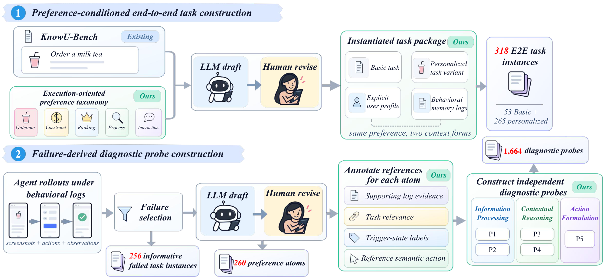

<div align="center">

# PrefDiag-Bench

### Diagnosing Personalization Failures in Mobile GUI Agents

**How should preferences change execution? When should they take effect?**

Zhixin Lin<sup>1,2</sup>, Dongliang Xu<sup>1,*</sup>, Jungang Li<sup>3,4</sup>, Shidong Pan<sup>5</sup>,<br>
Liang Liu<sup>2,&dagger;</sup>, Jun Feng<sup>6</sup>, Jing Li<sup>7</sup>, Yanbin Sun<sup>8</sup>, Yue Yao<sup>1,*</sup>

<sup>1</sup> Shandong University &nbsp; <sup>2</sup> VIVO AI Lab &nbsp; <sup>3</sup> HKUST (GZ) &nbsp; <sup>4</sup> HKUST<br>
<sup>5</sup> Independent Research &nbsp; <sup>6</sup> Institute of Automation, Chinese Academy of Sciences<br>
<sup>7</sup> University of Technology Sydney &nbsp; <sup>8</sup> Guangzhou University

<sup>&dagger;</sup> Project lead &nbsp; <sup>*</sup> Corresponding authors


[Overview](#overview) &nbsp; | &nbsp; [Benchmark](#benchmark) &nbsp; | &nbsp; [Diagnostic Probes](#diagnostic-probes) &nbsp; | &nbsp; [Release Plan](#release-plan) &nbsp; | &nbsp; [Citation](#citation)

**Paper:** arXiv link to be added after publication &nbsp; | &nbsp; **Project Page:** planned

</div>

> **Release status:** The code and dataset will be released in this repository. The project overview and paper figures are available now.

## Overview

A personalized GUI agent needs to complete a task while respecting the user's preferences throughout execution. For the same request, a preference may change the desired item, impose a budget, prioritize one candidate, require a comparison, or call for confirmation before acting.

**PrefDiag-Bench** evaluates two complementary questions:

1. **How** does a preference change the agent's execution requirements?
2. **When** should that preference become active in the current task and GUI state?

The benchmark pairs **end-to-end mobile GUI tasks** with **stage-wise diagnostic probes**. This pairing connects task outcomes with the capabilities needed to apply preferences, from interpreting user history to choosing an operation.

<p align="center">
  
</p>

## Benchmark

| Task Families | End-to-End Tasks | Diagnostic Probes | Preference Atoms | Evaluated Systems |
|:---:|:---:|:---:|:---:|:---:|
| **53** | **318** | **1,664** | **260** | **11** |

Each task family contains **one Basic task and five personalized variants**, giving 53 Basic and 265 personalized tasks. Tasks span seven application domains: communication, office, commerce, navigation, system settings, information retrieval, and social media.

### Five Preference Types

| Type | What Changes | Example Requirement |
|:---|:---|:---|
| **Outcome** | The desired result or final choice | Choose the user's usual sugar and ice options. |
| **Constraint** | Conditions that a valid choice or action must satisfy | Keep a purchase within the user's budget. |
| **Ranking** | Priorities among valid candidates | Prefer an official store when suitable options are available. |
| **Process** | The procedure used to complete the task | Compare prices across apps before purchasing. |
| **Interaction** | Whether, when, and how to communicate with the user | Request confirmation before adding an item to the cart. |

### Two Forms of User Context

- **Explicit User Profiles** state the user's preferences directly.
- **Behavioral Memory Logs** convey preferences through synthetic historical records, including supporting evidence and distracting context.

The two context forms are evaluated with the same task requirements, initialization, and success checker. End-to-end success requires satisfying the task goal and all applicable preference requirements.

<p align="center">
  
</p>

## Diagnostic Probes

P1-P5 examine five capabilities across information processing, contextual reasoning, and action formulation. Probe questions are evaluated independently, with reference prerequisites supplied where needed.

| Probe | Stage | Diagnostic Question |
|:---:|:---|:---|
| **P1** | Memory Induction | Can the agent recover a user preference from behavioral logs? |
| **P2** | Evidence Selection | Can it identify the historical records supporting a given preference? |
| **P3** | Relevance Selection | Can it identify which preference applies to the current task? |
| **P4** | Trigger Recognition | Can it recognize whether the current state triggers the preference? |
| **P5** | Operation Mapping | Can it select an appropriate operation once the preference is active? |

For task-level diagnostic scoring, all associated questions at a probe stage must be answered correctly. The task and diagnostic results can then be compared for the same task-preference pair.

## News

- **2026-10-06:** The public PrefDiag-Bench repository is online, with the project overview and paper figures.

## Release Plan

- [x] Publish the project overview and paper figures.
- [ ] Add the arXiv paper link.
- [ ] Release end-to-end task definitions, user profiles, and behavioral memory logs.
- [ ] Release diagnostic probe datasets and reference annotations.
- [ ] Release evaluation code and reproduction instructions.
- [ ] Launch the project page.

The code and dataset are being prepared for release. Release updates will be posted here; a release date has not yet been announced.

## Citation

```bibtex
@misc{lin2026prefdiagbench,
  title  = {Diagnosing Personalization Failures in Mobile GUI Agents},
  author = {Lin, Zhixin and Xu, Dongliang and Li, Jungang and
            Pan, Shidong and Liu, Liang and Feng, Jun and
            Li, Jing and Sun, Yanbin and Yao, Yue},
  year   = {2026},
  note   = {Preprint}
}
```

The citation will be updated with the arXiv identifier after publication.

## Contact

For questions about the benchmark or its release, please open a [GitHub issue](https://github.com/Zhixin-L/PrefDiag-Bench/issues).
