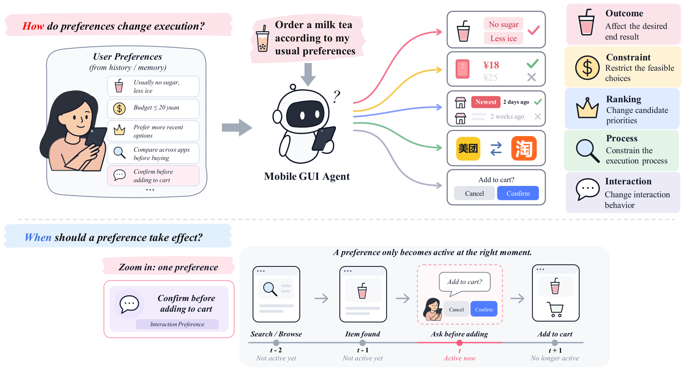

<div align="center">
  <h2>
    <a href="https://github.com/Zhixin-L/PrefDiag-Bench">
      PrefDiag-Bench: Diagnosing Personalization Failures in Mobile GUI Agents
    </a>
  </h2>
</div>

<p align="center">
  <a href="https://scholar.google.com/citations?user=dSQdVooAAAAJ">Zhixin Lin</a><sup>1,2</sup>,
  <a href="https://faculty.sdu.edu.cn/xudongliang/zh_CN/index.htm">Dongliang Xu</a><sup>1,*</sup>,
  <a href="https://github.com/LJungang">Jungang Li</a><sup>3,4</sup>,
  <a href="https://shidongpan.github.io/">Shidong Pan</a><sup>5</sup>,<br>
  <a href="https://yorkeyao.cc/">Liang Liu</a><sup>2,&dagger;</sup>,
  <a href="https://yorkeyao.cc/">Jun Feng</a><sup>6</sup>,
  <a href="https://yorkeyao.cc/">Jing Li</a><sup>7</sup>,
  <a href="https://yorkeyao.cc/">Yanbin Sun</a><sup>8</sup>,
  <a href="https://yorkeyao.cc/">Yue Yao</a><sup>1,*</sup>
</p>

<p align="center">
  <sup>1</sup> Shandong University &nbsp; <sup>2</sup> VIVO AI Lab &nbsp;
  <sup>3</sup> HKUST (GZ) &nbsp; <sup>4</sup> HKUST<br>
  <sup>5</sup> Independent Research &nbsp;
  <sup>6</sup> Institute of Automation, Chinese Academy of Sciences<br>
  <sup>7</sup> University of Technology Sydney &nbsp; <sup>8</sup> Guangzhou University
</p>

<p align="center">
  <em><sup>&dagger;</sup> Project lead &nbsp; <sup>*</sup> Corresponding authors</em>
</p>

<p align="center">
  📑 <a href="https://arxiv.org/"><b>Paper</b></a> &nbsp; | &nbsp;
  🏠 <a href="https://github.com/Zhixin-L/PrefDiag-Bench"><b>Project Page</b></a> &nbsp; | &nbsp;
  🤗 <a href="https://huggingface.co/datasets"><b>Dataset</b></a>
</p>

<p align="center">
  If you find this work useful, please consider starring ⭐ the repository to support our research.
</p>

## 📰 News

- **`2026-10-06`** We will release the code and data for **PrefDiag-Bench** soon. Stay tuned!

## 📖 PrefDiag-Bench Overview

Personalized GUI agents must do more than complete a request: they must determine **how user preferences should change execution** and **when those preferences should take effect** as GUI states change.

We introduce **PrefDiag-Bench**, combining **318 end-to-end mobile GUI tasks** with **1,664 task-linked diagnostic probes**. Its paired evaluation covers:

- 🎯 **Five execution-oriented preference types:** Outcome, Constraint, Ranking, Process, and Interaction.
- 🧠 **Two forms of user context:** explicit user profiles and behavioral memory logs.
- 🔍 **Five diagnostic stages (P1-P5):** memory induction, evidence selection, relevance selection, trigger recognition, and operation mapping.

We evaluate **11 GUI systems**, including nine end-to-end agents and two agentic workflows, and find:

- **Personalized tasks remain substantially harder than Basic tasks.** Ranking and Process are recurring difficulties; even Seed-2.0-Pro achieves only **47.17% TSR** on Process preferences with explicit profiles.
- **Explicit profiles do not consistently outperform behavioral logs.** The more effective context form varies across systems.
- **Evidence selection and trigger recognition are major bottlenecks.** Across the nine directly probed agents, these stages average **40.06%** and **39.69%** task-level accuracy, respectively, on the failure-derived diagnostic set.
- **Evidence guidance can improve execution.** On an **85-task controlled intervention subset**, labeling supporting and distracting logs raises TSR by up to **7.06 percentage points**, while benefits vary across systems.

Our results highlight the need to evaluate not only whether agents understand user preferences, but also whether they apply them reliably throughout task execution.

<p align="center">
  
</p>

## 📑 Citation

```bibtex
@misc{lin2026prefdiagbench,
  title  = {Diagnosing Personalization Failures in Mobile GUI Agents},
  author = {Lin, Zhixin and Xu, Dongliang and Li, Jungang and
            Pan, Shidong and Liu, Liang and Feng, Jun and
            Li, Jing and Sun, Yanbin and Yao, Yue},
  year   = {2026},
  note   = {Preprint}
}
```

## ✉️ Contact

For questions about the benchmark or its release, please open a [GitHub issue](https://github.com/Zhixin-L/PrefDiag-Bench/issues).
